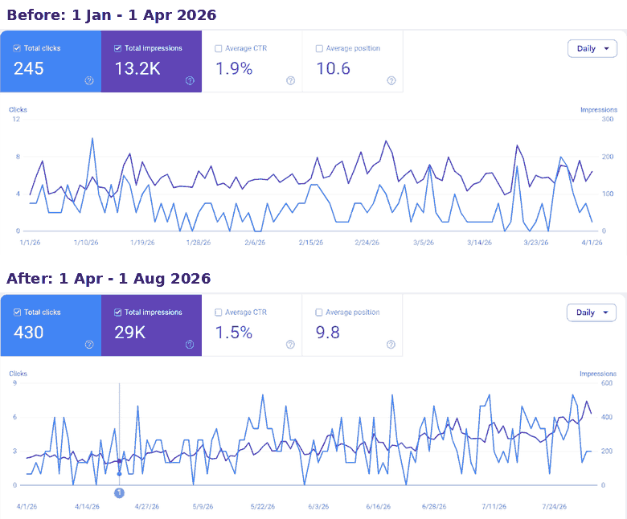

# SEO Case Study: Harsha Skin & Hair Clinic

**Client:** Harsha Skin & Hair Clinic, a dermatology practice in Nellore, India
**Site:** [harshaskinandhairclinic.com](https://harshaskinandhairclinic.com)
**Scope:** Ongoing local SEO: technical fixes, on-page optimisation, and Google Search Console monitoring against high-intent local searches such as "dermatologist in Nellore" and "skin and hair clinic Nellore".

## Results

Google Search Console, web search, comparing the period before the work began with the period after.

| Metric | Before (1 Jan – 1 Apr 2026) | After (1 Apr – 1 Aug 2026) | Change |
|---|---|---|---|
| Clicks per month | 81 | 105 | **+30%** |
| Impressions per month | 4,350 | 7,070 | **+62%** |
| Average position | 10.6 | 9.8 | **Up 0.8 places** |
| Average CTR | 1.9% | 1.5% | Down 0.4 pts* |

The two periods are different lengths (91 days and 123 days), so clicks and impressions are shown **per month** to compare like with like. Raw totals were 245 clicks and 13.2K impressions before, and 430 clicks and 29K impressions after.

\*CTR usually dips when impressions grow quickly, because the site starts appearing for more queries, including ones where it ranks lower. Clicks still grew by 30% a month.

### Latest 3 months (31 May – 25 Aug 2026)

365 clicks · 28,900 impressions · 1.3% CTR · average position 9.4

## What was done

- Technical and on-page SEO for a local clinic competing for high-intent searches in a mid-size Indian city
- Targeted local, commercial-intent keywords rather than broad informational terms, to prioritise patient enquiries over raw traffic
- Checked Search Console weekly to track indexing, query performance and position changes

## Takeaways

- Visibility grew faster than clicks. The next step is improving titles and meta descriptions on the pages that get the most impressions, to turn that visibility into more visits.
- The average position of 9.8 sits at the bottom of page one. Moving the main commercial pages into the top 5 is where most of the extra enquiries will come from.

---
*Built by Surya, True Digital — [thetruedigital.in](https://thetruedigital.in)*
